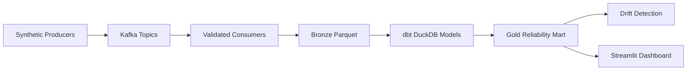

# Quantum Hardware Performance Intelligence Pipeline

End-to-end local data engineering demo for synthetic quantum hardware telemetry. The project simulates QPU events, validates them, lands bronze Parquet, transforms them with DuckDB/dbt, computes drift and SLA signals, and serves a Streamlit dashboard.

## Architecture



## What It Includes

- Synthetic QPU producers for telemetry, calibration runs, job execution, and system health.
- Kafka consumers with JSON Schema validation plus domain checks such as `T2 <= 2*T1` and job timing consistency.
- Bronze Parquet written as hive partitions under `data/bronze/<stream>/date=.../device_id=.../`.
- dbt models for bronze, silver, and gold layers in DuckDB.
- A `device_reliability_mart` with daily device KPIs, calibration counts, drift flags, job SLA, and health scores.
- Rolling z-score drift detection and Streamlit dashboard views.
- pytest coverage and GitHub Actions CI for core logic.

## Quickstart

```bash
python -m venv .venv
source .venv/bin/activate
make install
make sample
make dbt
python detection/drift_detector.py
make dashboard
```

The `make sample` path generates bronze Parquet directly without Kafka, which is the fastest way to review the end-to-end medallion and dashboard flow.

Install dbt/test dependencies with `make install-dev` when running local dbt models or pytest. `requirements.txt` is kept Streamlit-only so the hosted app does not install the dbt CLI stack.

## Streamlit Cloud Deploy

Use these settings in Streamlit Community Cloud:

- Repository: `sajansshergill/quantum-hardware-pipeline`
- Branch: `main`
- Main file path: `dashboard/app.py`

The deployed app bootstraps demo data automatically on first load because generated `data/` artifacts are not committed to Git.

## Kafka Demo

```bash
make up
make topics
python generator/telemetry_producer.py
python ingestion/consumers/telemetry_consumer.py
```

Run producers and consumers in separate terminals. `docker-compose.yml` starts Kafka and Zookeeper only; the Airflow DAGs are optional wrappers for environments where Airflow is already installed.

## Project Structure

```text
generator/                 Synthetic QPU device registry and Kafka producers
ingestion/consumers/       Kafka consumers and bronze Parquet writer
ingestion/schema/          JSON Schemas for source event contracts
dbt/                       DuckDB dbt project for bronze/silver/gold models
detection/                 Rolling z-score drift detector
dashboard/                 Streamlit dashboard
dags/                      Optional Airflow DAG wrappers
scripts/                   Local demo helpers
tests/                     pytest suite
```

## Data Model

The synthetic fleet includes `ibm_fez`, `ibm_torino`, `ibm_kyiv`, and `ibm_osaka`. Telemetry is generated per qubit with T1/T2 coherence, single- and two-qubit gate errors, and readout fidelity. Jobs capture queue and execution time, final status, error code, and SLA compliance. Health records capture cryostat stability, control electronics, network status, and health score.

The gold mart is aggregated per `device_id` and `date`:

- `avg_T1_us`, `avg_T2_us`
- `p99_gate_error_1q`, `p99_gate_error_2q`
- `min_readout_fidelity`
- `calibration_count`, `successful_calibration_count`
- `drift_flag`
- `job_count`, `job_sla_pct`
- `avg_system_health_score`, `min_system_health_score`

## Common Commands

```bash
make test          # Run pytest
make sample        # Generate local bronze sample data
make dbt           # Run dbt models and dbt tests
make dashboard     # Launch Streamlit
make clean         # Remove generated data and local artifacts
```

## Configuration

Copy `.env.example` to `.env` if you want to override defaults. The main settings are:

- `KAFKA_BOOTSTRAP`
- `BRONZE_ROOT`
- `DUCKDB_PATH`
- `DRIFT_ALERTS_PATH`

## Notes

Airflow is intentionally optional for the local MVP. The runnable path is `make sample && make dbt && python detection/drift_detector.py && make dashboard`; the DAGs wrap the same commands for scheduler-based demos.
